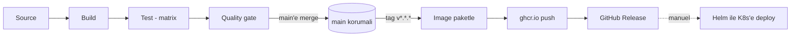

# Gün 11 - Pipeline Tasarımı

Bugün araç kullanılmıyor. Amaç, tek satır YAML yazmadan önce pipeline'ın ne yapacağına karar
vermek. Sonraki günlerdeki workflow dosyaları bu sayfanın uygulaması olacak.

## Ele alınan uygulama

`devops-training` içindeki örnek servis: dört endpoint'i olan küçük bir Node.js/Express
uygulaması.

| Path       | Amaç                                  |
|------------|---------------------------------------|
| `/`        | Karşılama mesajı + sürüm              |
| `/healthz` | Liveness probe hedefi                 |
| `/ready`   | Readiness probe hedefi (warm-up var)  |
| `/metrics` | Bellek içi istek sayacı               |

Pipeline'ın ürettiği artifact, GitHub Container Registry'ye (`ghcr.io`) push edilen bir
container image. Tarball ya da zip değil; aşamadan aşamaya taşınan ve sonunda deploy edilen
şey bu image. Geri kalan çıktılar (coverage raporu, SARIF bulguları) kapı kontrolü için
üretilen yan ürünler, teslim edilen şey değil.

## Aşamalar

| Aşama   | Tetikleyici      | Girdi              | İşlem                                | Çıktı                        | Geçiş koşulu                          |
|---------|------------------|--------------------|--------------------------------------|------------------------------|---------------------------------------|
| Source  | push / PR / tag  | Git commit         | Checkout                             | Çalışma ağacı                | -                                     |
| Build   | push / PR        | Kaynak kod         | `npm ci`, `npm run build`            | Kurulu bağımlılıklar         | Kurulum ve build 0 ile çıkar          |
| Test    | push / PR        | Build çıktısı      | Matrix üzerinde `jest --coverage`    | Test sonuçları, lcov raporu  | Tüm matrix girdilerinde testler geçer |
| Quality | push / PR        | Kaynak + coverage  | ESLint, coverage eşiği, CodeQL       | Lint çıktısı, SARIF          | Lint hatasız, coverage eşiğin üstünde, high/critical SAST bulgusu yok |
| Package | tag `v*.*.*`     | Kaynak kod         | `docker build`                       | Container image              | Image build olur                      |
| Publish | tag `v*.*.*`     | Image              | Semver etiketleriyle `ghcr.io` push  | Registry'de sürümlü image    | Push başarılı                         |
| Release | tag `v*.*.*`     | Git geçmişi        | GitHub Release oluştur               | Otomatik notlarla release    | Release oluşur                        |
| Deploy  | manuel           | Yayınlanmış image  | Yerel cluster'a `helm upgrade`       | Çalışan release              | Rollout sağlıklı, probe'lar geçer     |

## Diyagram

Kesikli ok bilinçli, aşağıdaki deploy notuna bakınız.

## Kararlar

### PR'da ne çalışır, tag'de ne çalışır

Kod değişikliği yüzünden bozulabilecek her şey `main`'e giden her push ve pull request'te
çalışır: install, build, matrix test, lint, coverage, CodeQL. Bunlar ucuz adımlar ve branch
protection'ın baktığı kontroller de bunlar.

Paketleme ve yayınlama sadece `v*.*.*` tag'inde çalışır. Feature branch'teki her commit için
image build edip push etmenin anlamı yok; registry çöple dolar ve hangi image'ın gerçek bir
sürüm olduğu belirsizleşir. Tag atmak, "bu commit bir sürümdür" diyen açık bir insan
kararıdır.

Sürümleme semver. `v1.2.3` tag'i dört image etiketi üretiyor: `1.2.3`, `1.2`, `1` ve
`latest`. Tam sürüm etiketi değişmez kabul ediliyor; `latest` değişken ve sadece yerel test
kolaylığı için var, bir deployment'ın ona pin'lenmesi doğru değil.

### Artifact saklama ve saklama süresi

- Coverage raporu: GitHub Actions artifact'ı olarak yükleniyor, 7 gün saklanıyor. Tek amacı
  başarısız bir run'ı incelemek olduğu için daha uzun tutmanın faydası yok.
- Container image'lar: GitHub Container Registry, otomatik silme yok. Semver etiketli
  image'lar saklanıyor çünkü rollback hedefi onlar.
- CodeQL bulguları: GitHub Security sekmesinde, platform tarafından saklanıyor.

### Rollback stratejisi

Image etiketleri değişmez olduğu için daha önce yayınlanan her sürüm hâlâ çekilebilir
durumda. Tercih sırasıyla iki yol:

1. `helm rollback myapp <revision>` - en hızlısı. Config değişiklikleri dahil tüm release'i
   geri alıyor, Helm revision geçmişini zaten tutuyor.
2. `helm upgrade myapp ./helm/myapp --set image.tag=<önceki sürüm>` - sadece image'ın geri
   gitmesi gerektiği, mevcut değerlerin doğru olduğu durumda.

Pipeline'da otomatik rollback yok. Olması için deploy adımının gerçekten CI'da çalışması
gerekirdi, ki çalışmıyor (aşağıda).

### Secret'lar

- `GITHUB_TOKEN` - Actions tarafından otomatik veriliyor. GHCR'a push için `packages: write`,
  release oluşturmak için `contents: write` izni gerekiyor. Personal access token gerekmiyor;
  olay da bu zaten, repoda uzun ömürlü hiçbir kimlik bilgisi durmuyor.
- `SONAR_TOKEN` - sadece opsiyonel SonarCloud job'ı açılırsa gerekiyor. Repository secret.
- `API_KEY` - uygulamanın kendi secret'ı. Image'a gömülmüyor ve build arg olarak da
  geçilmiyor. Çalışma zamanında Kubernetes Secret'ından geliyor (Gün 17).

Kural şu: build zamanı secret'ları CI platformuna, çalışma zamanı secret'ları cluster'a ait;
ikisi de Git'e ait değil.

### Deploy neden manuel

Cluster yerel bir minikube. GitHub'ın barındırdığı runner ona erişemez, bir dizüstü
bilgisayara içeri doğru rota yok. Bu yüzden `release.yml`'deki deploy adımı, çalıştıracağı
komutu ekrana basan bir placeholder.

Gerçekten çalışması için şunlardan biri gerekirdi: aynı makinede self-hosted runner, dışarı
açık bir cluster, ya da cluster'ın içinde çalışıp registry'yi veya repoyu izleyen pull tabanlı
bir GitOps agent'ı (ArgoCD/Flux). Pratikte kullanılacak olan GitOps seçeneği, çünkü cluster'ı
internete açmayı hiç gerektirmiyor.

Bu program kapsamında deploy elle `helm upgrade` ile yapılıyor ve Gün 20 demosunda bu adım
otomatikmiş gibi gösterilmeden açıkça çalıştırılıyor.
